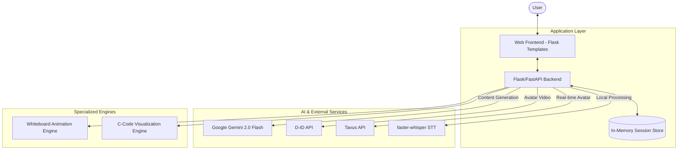

# AI Tutor System Architecture

This document provides a detailed overview of the technical architecture and workflows of the AI Tutor platform.

## 🏗 High-Level Architecture

The system follows a multi-tier architecture, integrating various AI services and local processing to deliver a multi-modal learning experience.

## 🧩 Component Breakdown

### 1. Web Frontend
- **Framework**: Flask-driven HTML templates with vanilla JavaScript.
- **Visuals**: Leverages Material Dashboard theme, Mermaid.js for diagrams, and P5.js for interactive simulations.
- **State Management**: Client-side `TeachlyUserProfile` stored and updated via API calls to track learning preferences.

### 2. Flask/FastAPI Backend (`main.py`)
- **Core Logic**: Manages routing, session handling, and orchestration between various AI services.
- **PDF/PPT Processing**: Extracts text using `PyPDF2` and `python-pptx`, then simplifies it via Gemini for script generation.
- **Adaptive Prompting**: Constructs complex system prompts for Gemini based on user profiles to personalize the educational "Persona".

### 3. Whiteboard Animation Engine
- **Input**: Topic or script from Gemini.
- **Process**: Gemini generates a structured response with `STEP_N` markers and ASCII diagrams.
- **Rendering**: The frontend parses the structured text and animates the whiteboard content line-by-line.

### 4. Code Visualization Engine
- **Functionality**: Converts C snippets into a JSON-based execution trace.
- **Visualization**: Shows stack/heap memory, function frames, pointers, and syscall blocking status.
- **Context**: Specifically optimized for UNP (Unix Network Programming) code examples.

## 🔄 Core Workflows

### AI Tutor Adaptive Loop
1. User sends a message via `AskTeach`.
2. Backend retrieves User Profile and current learning focus.
3. System prompt is dynamically built including profile context.
4. Gemini generates a response (text, Mermaid diagram, or P5.js code).
5. User Profile is updated based on Gemini's "updates" fields (e.g., increasing confidence score).

### Avatar Video Generation Flow
1. Script is generated/expanded from a PDF/PPT.
2. Backend calls D-ID `/clips` (for preset presenters) or `/talks` (for custom images).
3. Audio is generated via Microsoft TTS (integrated into D-ID).
4. Video URL is returned to the frontend for playback.

## 🔐 Security & Operations
- **API Management**: Keys are managed via Environment Variables.
- **Deployment**: Configured for Genezio or local Docker deployment.
- **Monitoring**: Logging via standard Flask logger for debugging API interactions.
