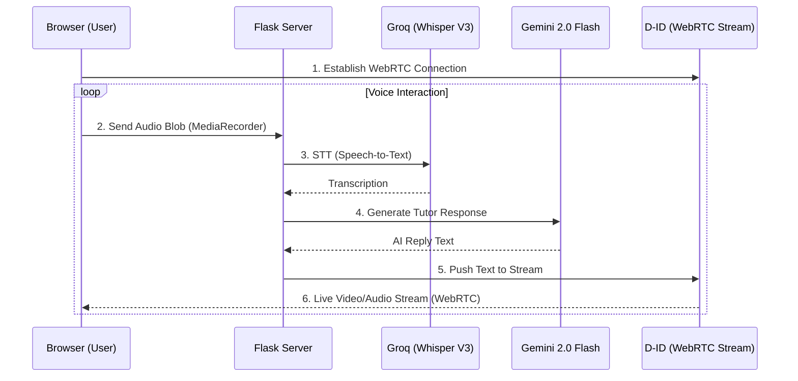

# Real-Time AI Architecture (D-ID + Groq)

This document outlines the architecture and technical implementation of the "Real-Time AI Video Call" feature, which enables low-latency, face-to-face interaction with an AI Tutor.

## 🏗 System Architecture

The real-time loop is designed for maximum speed, bypassing traditional video rendering wait times by using WebRTC streaming.

## 🛠 Tech Stack

| Component | Technology | Role |
| :--- | :--- | :--- |
| **Streaming** | D-ID WebRTC API | Low-latency animated avatar streaming. |
| **STT** | Groq (Whisper-large-v3) | Ultra-fast transcription (<500ms). |
| **Brain**| Gemini 2.0 Flash | Context-aware tutoring logic. |
| **Frontend** | Vanilla JS + WebRTC | Session management and media handling. |

## 🚀 Key Features

### 1. Zero-Wait Interactions
Unlike the standard video generation flow (which takes ~15-30s), this system uses D-ID's streaming endpoint. The avatar starts speaking almost instantly after the user finishes their sentence.

### 2. Voice Activity Flow
The frontend captures audio segments. Once voice activity is detected or a segment is completed, it's POSTed to `/process-audio`. This ensures the AI is "listening" while the user talks.

### 3. Smart Hallucination Filter
The backend includes a filter to ignore common "Whisper hallucinations" (e.g., "Thank you", "MBC News") that often occur in silent or noisy audio segments, preventing the AI from responding to background noise.

## 📂 Key Files
- [video_call.html](file:///Users/sufyanchamadia/Documents/Documents%20-%20Sufyan’s%20MacBook%20Air/AI%20Tutor/templates/video_call.html): The WebRTC client and UI.
- [main.py](file:///Users/sufyanchamadia/Documents/Documents%20-%20Sufyan’s%20MacBook%20Air/AI%20Tutor/main.py): Contains the `/process-audio` and D-ID stream management endpoints.

---

> [!TIP]
> This implementation is distinct from the **Tavus** integration. While Tavus provides a high-end "Replica" experience, the D-ID + Groq stack offers a more customizable, internal pipeline for rapid prototyping of different tutor personas.
