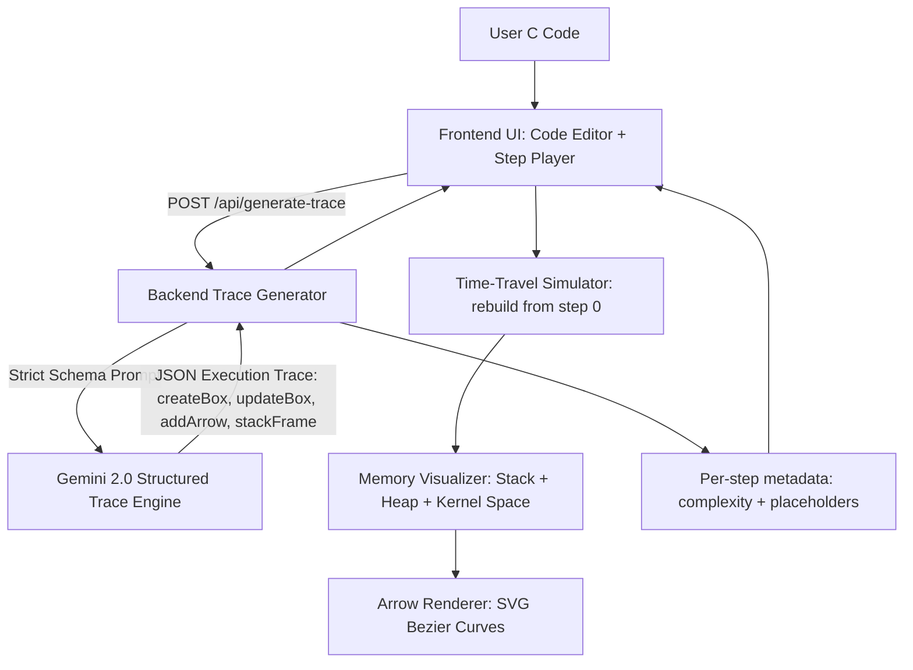

# Code Explainer — Single-Step Symbolic Debugger (Interview Explanation)

## What it is (1–2 lines)
**Code Explainer** is a *Single-Step Symbolic Debugger* that focuses on **memory visualization**, not just code translation.  
It converts C code into a **JSON execution trace** that animates what happens in **Stack**, **Heap**, and **Kernel Space** over time.

---

## Architecture Diagram (Mermaid)

---

## Core Concept: The Symbolic Trace
> “The Code Explainer isn’t a simple line-by-line translator. I built it as a **Static Analysis Engine** that converts raw C code into a **JSON-based Execution Trace**.”

This execution trace models the lifecycle of:
- **Stack frames** (function calls, local variables)
- **Heap allocations** (`malloc`, `free`)
- **Kernel space objects** (networking structures like sockets, OS-handled resources)

The output is a structured sequence of actions (like a “movie script”) that the frontend renders step-by-step.

---

## Architecture Overview

### Components
- **Frontend (Visualizer + Time-Travel Player)**
  - Renders memory boxes + arrows
  - Step navigation (Prev/Next)
  - Reconstructs state deterministically
- **Backend (Trace Generator)**
  - Converts C code → JSON trace
  - Applies schema validation + safety rules
  - Adds complexity/metadata per step
- **LLM Layer (Gemini 2.0 API)**
  - Produces structured trace output under strict schema
  - Enforces action-based memory updates

---

## High-Level Technical Flow

### A) Trace Generation (Backend Logic)

#### 1) Context-Aware Prompting
- The backend sends:
  - The **C source code**
  - A **strict JSON schema**
  - A system prompt with allowed actions:
    - `createBox`
    - `updateBox`
    - `addArrow`
    - `stackFrame`
    - *(and other controlled steps)*

✅ This prevents free-form hallucinated explanations and forces the model to output only **visualizable state changes**.

#### 2) Networking Knowledge (UNP-aware)
Because the app is frequently used for **Unix Network Programming**, the prompt is optimized to detect:
- `sockaddr_in`
- `fork()`
- `recvfrom()`
- `sendto()`
- file descriptors, sockets, ports

These are mapped into a **Kernel Space** segment of the memory view so students can see OS-managed resources clearly.

---

### B) The “Time-Travel” Engine (Frontend Logic)

#### 1) Deterministic State Reconstruction (No state leak)
A key design decision:
> “Prev/Next does not just patch DOM state.”

Instead, the frontend **re-simulates memory from step 0** up to the current step:
- prevents **state leak**
- ensures reproducibility
- guarantees correct rollback behavior

**Why this matters:**  
If you go backwards, old values don’t remain stuck in UI by mistake.

#### 2) Process Visualization (fork-aware)
For `fork()`:
- the trace creates separate **process groups**
- parent and child memory are visualized as:
  - cloned at fork
  - then independent after

This makes concurrency behavior intuitive:
- “same memory snapshot at fork”
- “diverges as execution continues”

---

### C) Complex Type Visualization

#### 1) Pointers and Arrows
Pointer operations generate actions like:
- `addArrow(fromVar, toAddress)`

Frontend behavior:
- compute bounding boxes of variables
- render SVG Bezier curves
- connect pointer variables → target memory blocks

✅ Students *see* pointer relationships instead of guessing.

#### 2) Arrays and Structs (Truncation Rule)
For large buffers like:
- `char buf[4096]`

A truncation rule is applied:
- show first **10 bytes**
- then show `...` to keep UI clean  
This maintains correctness while preventing overload.

---

## “Pro Tips” (Highlights to Impress Interviewers)

### 1) Complexity per step
Each step includes an estimated complexity tag such as:
- `O(1)`
- `O(N)`
- `O(RTT)` for network calls

This teaches performance thinking alongside memory behavior.

### 2) Symbolic Execution for runtime-dependent values
For values controlled by OS/runtime (e.g., ephemeral ports), the engine uses placeholders:
- `"Assigned Port"`
- `"OS Allocated FD"`
- `"Unknown runtime value"`

This keeps the trace sound without requiring a real compiler.

### 3) UX / Animation
The frontend animates stack frame push/pop with:
- GSAP or CSS transitions

This makes stack behavior visually intuitive.

---

## Example Flow (Short)
**User code:**
1) Creates socket  
2) Calls `fork()`  
3) Reads data via `recvfrom()`  
4) Writes into buffer  
5) Frees memory

**What the Code Explainer shows:**
- Kernel Space: socket + fd created
- Stack: function frame + locals
- Heap: allocated buffers
- Arrows: pointer → heap memory
- Fork: child process group created

---

## Summary for Interviewer (Perfect Closing)
> “My goal was to take the magic out of memory management.  
By visualizing how `malloc()` moves data into the Heap or how `free()` removes it, students don’t just read the code — they *see the machine*.”

---

## One-Line Elevator Pitch
**“It’s a symbolic, step-by-step memory debugger powered by structured LLM traces and a deterministic time-travel visualizer.”**
